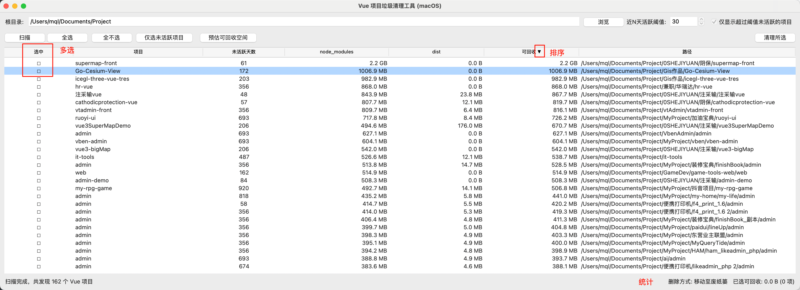
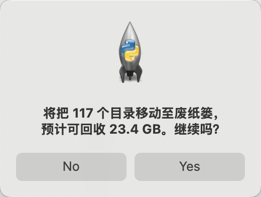

# Vue 项目垃圾清理工具 (macOS)

> 设计和编码由 chatgpt-5 实现


一个用于 macOS 的桌面 GUI 工具。递归扫描指定根目录下的 Vue 项目，统计并清理每个项目的 `node_modules` 与 `dist` 目录，以释放磁盘空间。支持“移至废纸篓”（安全）或永久删除（需确认）。

- 高效扫描：跳过常见大目录，独立后台线程不中断 UI
- 风险可控：优先移至废纸篓，可撤销
- 一键操作：过滤、全选、预估、清理一步到位

---

## 目录
- [Vue 项目垃圾清理工具 (macOS)](#vue-项目垃圾清理工具-macos)
  - [目录](#目录)
  - [特性](#特性)
  - [截图](#截图)
  - [架构与工作原理](#架构与工作原理)
  - [系统要求](#系统要求)
  - [安装与运行](#安装与运行)
  - [使用指南](#使用指南)
  - [配置项](#配置项)
  - [安全性与删除策略](#安全性与删除策略)
  - [性能与限制](#性能与限制)
  - [常见问题](#常见问题)
  - [贡献](#贡献)
  - [许可协议](#许可协议)
  - [版本规划](#版本规划)
  - [可选：打包独立应用](#可选打包独立应用)

---

## 特性
- 自动识别 Vue 技术栈项目（通过 `package.json` 依赖关键字）
- 统计项目未活跃天数（排除 `node_modules`/`dist`/`.git` 等目录）
- 过滤“超过 N 天未活跃”的项目
- 预估选中项目可回收空间
- 一键清理 `node_modules` 与 `dist`（移至废纸篓或永久删除）
- 实时状态与选择统计，清理过程后台执行

## 截图
- 主界面与扫描结果：`docs/screenshot-main.png`
  
  
- 清理确认弹窗：`docs/screenshot-confirm.png`
  
  

## 架构与工作原理
- UI 层：Tkinter + ttk 组件（Treeview 展示项目列表）
- 扫描线程：后台遍历目录，识别 Vue 项目，计算 `node_modules`/`dist` 体积，估算最近活跃时间
- 过滤与排序：未活跃天数降序、可回收空间降序
- 删除执行：`send2trash` 优先；否则永久删除（带二次确认）
- 关键常量：
  - `SKIP_FOLDERS`：扫描时跳过的大目录集合
  - `VUE_SIGNATURES`：识别 Vue 项目的依赖关键字集合

## 系统要求
- 操作系统：macOS
- Python：3.8 及以上
- 可选依赖：`send2trash`（推荐，用于移至废纸篓）

## 安装与运行
建议使用虚拟环境（zsh 示例）：

```bash
# 1) 创建并启用虚拟环境（可选）
python3 -m venv .venv
source .venv/bin/activate

# 2) 安装依赖
pip install -r requirements.txt

# 3) 启动程序
python3 main.py
```

## 使用指南
1. 选择根目录：点击“浏览”选择需要扫描的根路径（默认家目录）。
2. 设置活跃阈值：通过“近N天活跃阈值”与“仅显示超过阈值未活跃的项目”过滤目标。
3. 扫描：点击“扫描”，等待结果逐步填充表格。
4. 勾选与批量选择：点击表格首列复选框，或用“全选/全不选/仅选未活跃项目”。
5. 预估可回收空间：点击“预估可回收空间”查看当前勾选的总回收量。
6. 清理所选：点击“清理所选”，确认后开始清理 `node_modules` 和 `dist`；状态栏显示进度，列表随删除动态刷新。

## 配置项
- UI 配置：
  - 根目录：扫描起点
  - 近N天活跃阈值：过滤未活跃项目
  - 仅显示超过阈值未活跃的项目：是否启用过滤
- 代码层面：
  - `SKIP_FOLDERS`：扫描时跳过的目录集合
  - `VUE_SIGNATURES`：判定 Vue 项目的依赖关键字列表

> 如需自定义识别规则或跳过更多目录，可直接修改上述常量。

## 安全性与删除策略
- 安装 `send2trash`：将选中目录“移至废纸篓”，可从废纸篓恢复。
- 未安装 `send2trash`：执行永久删除，且会在操作前进行确认弹窗。
- 删除范围：仅针对每个项目的 `node_modules` 与 `dist` 目录，不会删除项目本身目录与其它文件。

## 性能与限制
- 扫描与统计在后台线程执行，不阻塞 UI，但大目录下计算大小可能耗时。
- 默认跳过大型目录（例如 `node_modules`/`.git` 等）以提升遍历效率。
- 跳过符号链接，避免循环引用与意外跨卷删除。
- Vue 项目识别基于 `package.json` 依赖关键字，非典型项目可能被遗漏或误判。
- 活跃度基于文件系统时间戳估算，结果仅供参考。

## 常见问题
- 运行后没弹窗？
  - 运行 `python3 -m tkinter` 检查 Tk 是否可用；确保非 SSH/无显示环境。
  - 使用 python.org 或 Homebrew 的 Python 3（3.8+）。
- 显示“将永久删除”？
  - 安装 `send2trash`：`pip install send2trash`。
- 扫描很慢？
  - 确保根目录合理，不要直接扫描整个系统盘；扩展 `SKIP_FOLDERS` 跳过更多目录。
- 误删如何恢复？
  - 使用废纸篓时可恢复；永久删除不可恢复，请谨慎操作。

## 贡献
- 提交 Issue 反馈 bug/建议。
- 提交 PR 改进代码或文档（建议保留类型注解，避免阻塞 UI 线程的耗时操作）。
- 代码风格：PEP 8；函数尽量小而清晰；I/O 放后台线程。

## 许可协议
- 建议使用 MIT License。若需要，请新增 `LICENSE` 文件并注明版权归属。

## 版本规划
- 并发/多线程优化，提升大目录扫描速度。
- 自定义规则：允许在 UI 中添加/编辑跳过目录与识别关键字。
- 扩展更多技术栈识别（React/Vite/Next 等）与可选清理项（`.cache`/`.turbo` 等）。
- 国际化与深色模式。
- 打包为独立 `.app`（PyInstaller），便于非技术用户使用。

## 可选：打包独立应用
使用 PyInstaller 打包为可分发应用：

```bash
pip install pyinstaller
pyinstaller --noconsole --name VueCleaner --windowed main.py
```

产物位于 `dist/VueCleaner/`，可直接双击运行（首次启动可能受 Gatekeeper 限制）。
